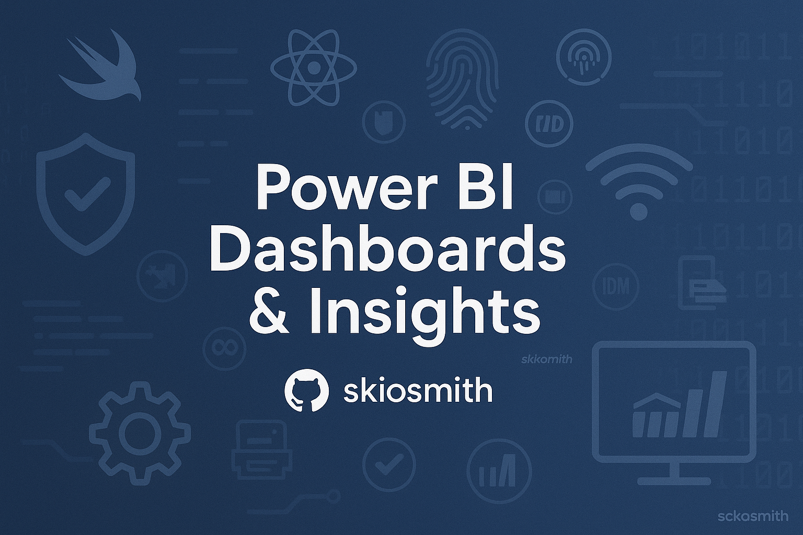

# PowerBI-Projects

Welcome to my collection of Power BI projects. These dashboards are the result of hands-on work with real-world datasets, focusing on storytelling through data, interactive visualization, and efficient data modeling.

---

## 🔍 Projects

### 📊 Data Professional Survey Breakdown

A comprehensive analysis of a global survey on data professionals. This dashboard explores trends in roles, technologies, work-life balance, and diversity across countries.

**Highlights:**
- Power Query for data preparation
- Clean modeling for optimal performance
- Donut charts, slicers, maps, and bar visuals
- Actionable insights and interactive filtering

> 📂 Navigate to the project folder: [`/dataprofessionalsurvey`](dataprofessionalsurvey/)

---

## 💡 Tools & Techniques

- Power Query (data cleaning and transformation)
- Data Modeling (optimized data types and relationships)
- DAX (where needed)
- Advanced visualization techniques
- Interactive dashboards for end-user exploration

---

## 📁 Structure

Each project contains:
- `.pbix` report file
- A detailed `README.md`
- A `.assets/` folder with visuals or screenshots.

---

### [💼 OsStores Financial Dashboard](financialdashboards/README.md)

An executive-level dashboard analyzing the financial performance of OsStores over time, including discounts, sales, profit, and margins.

**Highlights:**
- Power Query data cleansing with custom steps.
- Custom Date Table using `CALENDAR` and `CALENDARAUTO`
- DAX measures including `Profit Margin`, `Sales Amount`, and Time Intelligence calculations.
- Dashboard layout with professional theming and dynamic filters.

> Explore the project: [`/financialdashboards`](financialdashboards/)

---

## 📂 Repository Layout

Each folder contains:
- `.pbix` Power BI project file.
- A dedicated `README.md` with project overview and screenshots.
- A `.assets/` folder containing visuals.

---

## 👤 About Me

**Username:** [`skiosmith`](https://github.com/skiosmith)  
Passionate about data, design, and delivering clear stories through dashboards.

Feel free to explore, connect, and give feedback!

---
