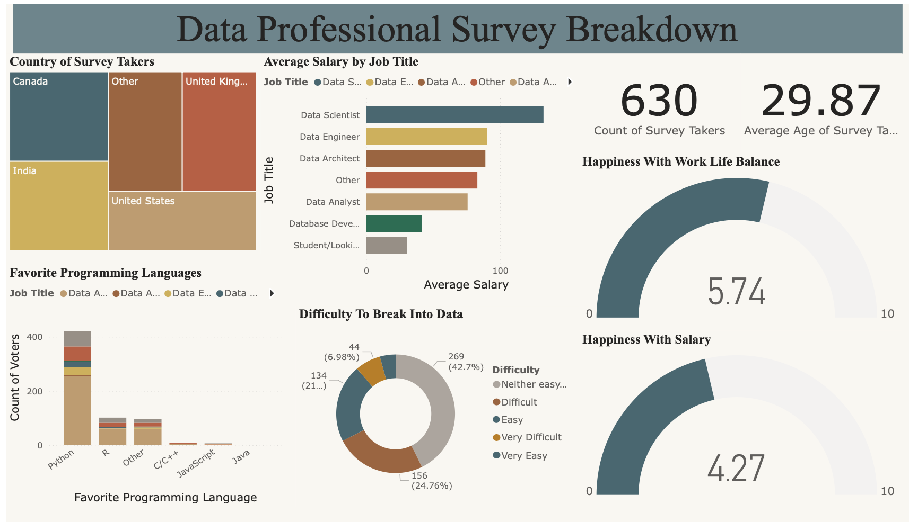
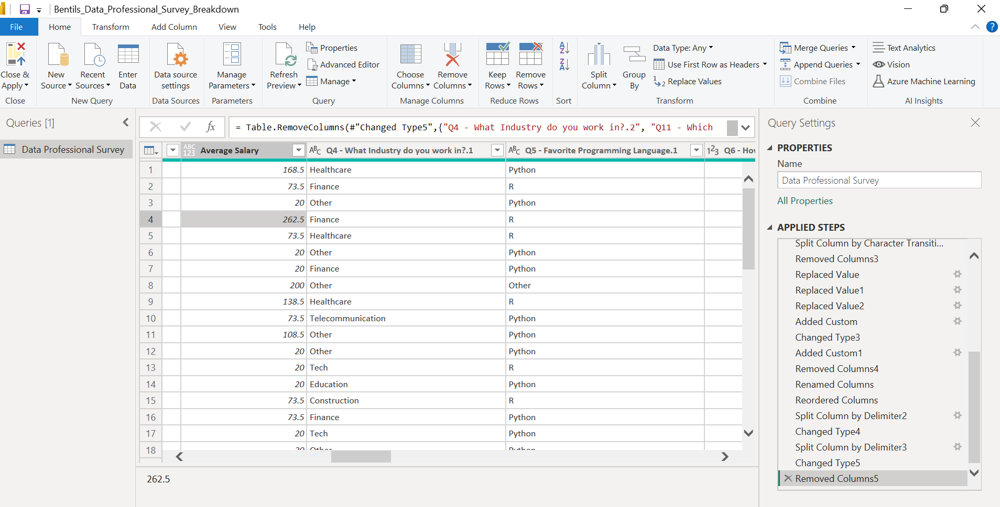
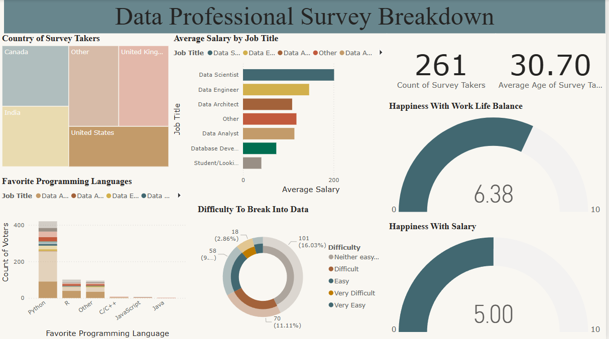
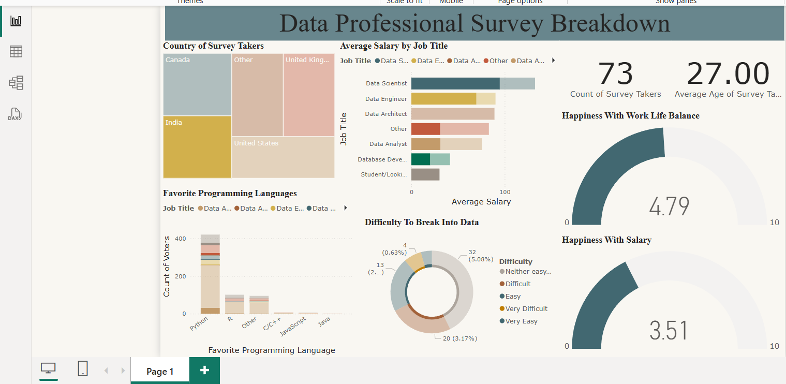

# 📊 Data Professional Survey Breakdown

An interactive Power BI dashboard analyzing a global survey of data professionals. This project provides insights into job roles, programming languages, salaries, education levels, work-life balance, and working environments across different countries.

---

## 📊 Dashboard Overview

The dashboard offers filters for country, job role, and experience to help users explore:

- Most common roles and programming languages preferred.
- Salary patterns by region and role.
- Work-life balance satisfaction.
- Salary satisfaction.
- Difficulty breaking into the Data field.

---

## 🧹 Data Preparation

In Power Query, I cleaned and transformed the dataset by:

- Removing null and irrelevant values.
- Renaming and splitting columns.
- Using custom delimiters.
- Changing data types for modeling.

---

## 🧩 Data Modeling

- Relationships were structured for clean navigation and performance.
- Dimensions and fact tables organized logically.

---

## 🔍 Focused Insights

Here are focused views from the dashboard filtered by country:

### United States

### India

---

## 🛠️ Key Skills Demonstrated

- Data cleaning using Power Query.
- Efficient data modeling for reporting.
- Designing intuitive visuals (charts, slicers, maps).
- Deriving actionable insights from survey data.

---

## 📁 Files in this Project

- `Bentils_Data_Professional_Survey_Breakdown.pbix` – The Power BI report.
- `.assets/` – All project images and screenshots.
- `README.md` – Documentation for the project.

---

## 📌 About

**Author**: [skiosmith](https://github.com/skiosmith)

This was my first Power BI project, and it strengthened my skills in visual analytics, data prep, and building insightful dashboards.
