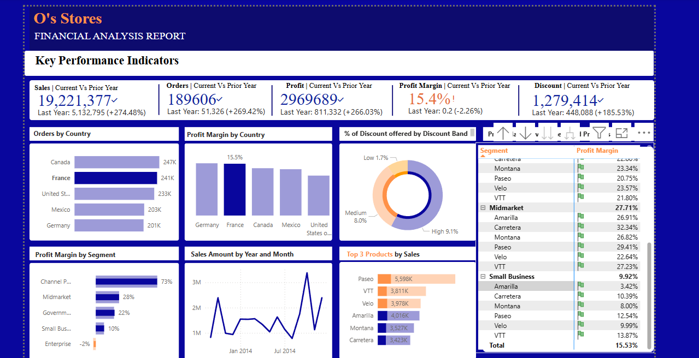
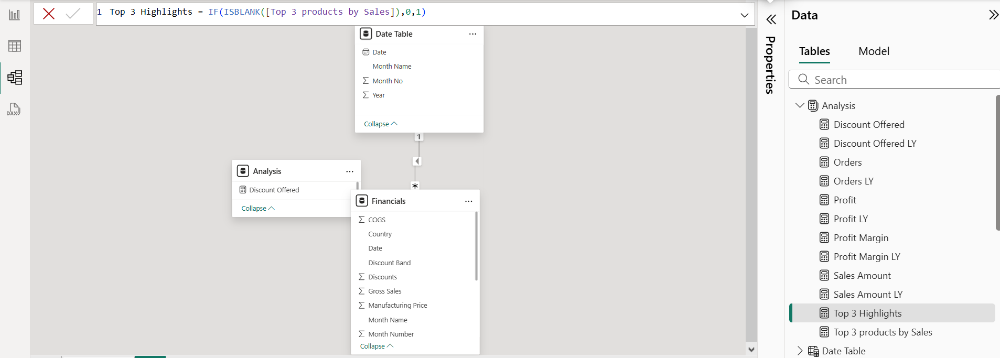
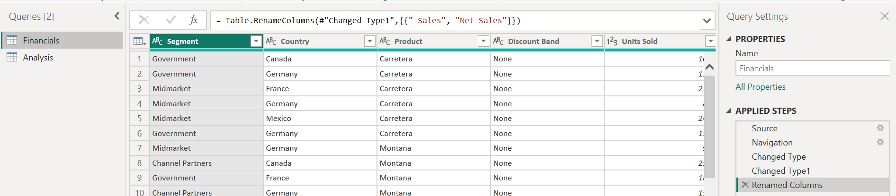
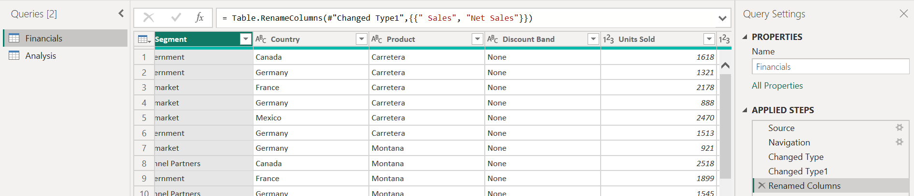
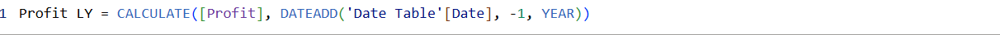

# 📊 OsStores Financial Performance Dashboard

A Power BI dashboard project analyzing the financial performance of OsStores over time. This report offers insights into sales, profit, discount trends, and key KPIs, with time intelligence to compare yearly metrics. 

---

## 🔍 Problem Statement

OsStores needed a way to track their financial performance — identifying trends in revenue, profit margins, and discount impact — across time. This dashboard offers executives and analysts a visually clear and data-rich summary of how the business is performing.

---

## 🚀 Project Highlights

**📌 Data Preparation**
- Used **Power Query** to clean the dataset by:
  - Changing data types
  - Removing nulls
  - Renaming and transforming columns
- Split and filtered unnecessary rows and ensured schema consistency.

**🔧 Data Modeling**
- Created a custom **Date Table** using `CALENDARAUTO()` and `CALENDAR()` functions.
- Linked Date Table to Financials for accurate time-based filtering.
- Used `Enter Data` to add manual table where needed.

**📐 DAX Measures**
- Built key KPIs using DAX including:
  - `Profit = SUM(Financials[Profit])`
  - `Profit Margin = DIVIDE([Profit], [Sales Amount])`
  - `Discount Offered LY = CALCULATE([Discount Offered], DATEADD('Date Table'[Date], -1, YEAR))`

**📊 Dashboard Visuals**
- Customized background and layout
- Created theme and formatting for brand consistency
- Used a combination of:
  - KPI cards
  - Time comparison charts
  - Dynamic bar/line visuals
  - Custom slicers and filters

---

## 🖼️ Screenshots

| View | Description |
|------|-------------|
|  | Final dashboard overview |
|  | Relationship model between tables |
|  | Data cleaning steps (part 1) |
|  | Data cleaning steps (part 2) |
|  | DAX formula showing time intelligence |

---

## 📁 Project Structure
